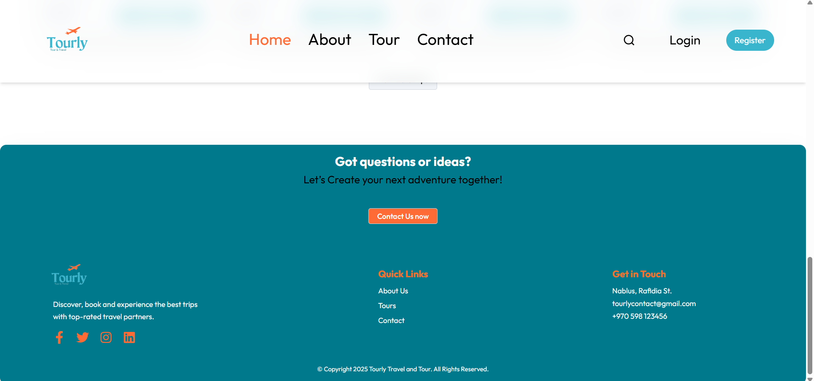
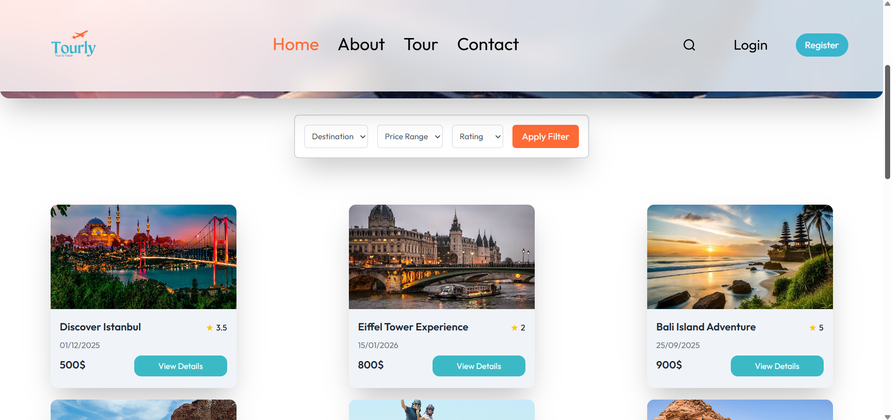
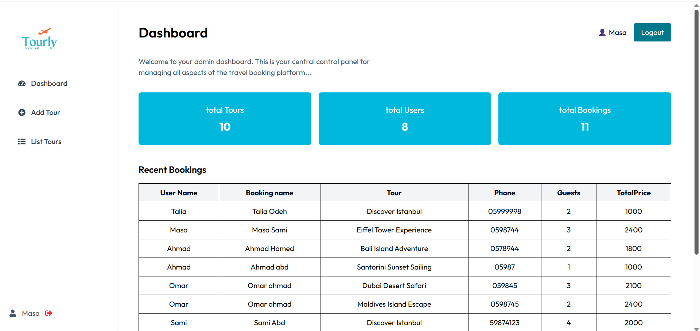
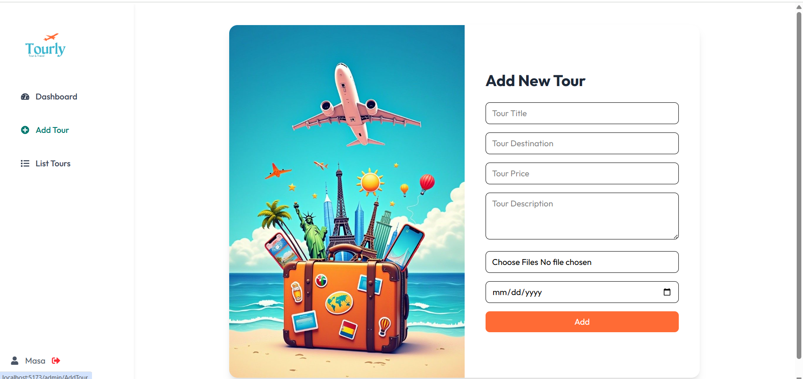
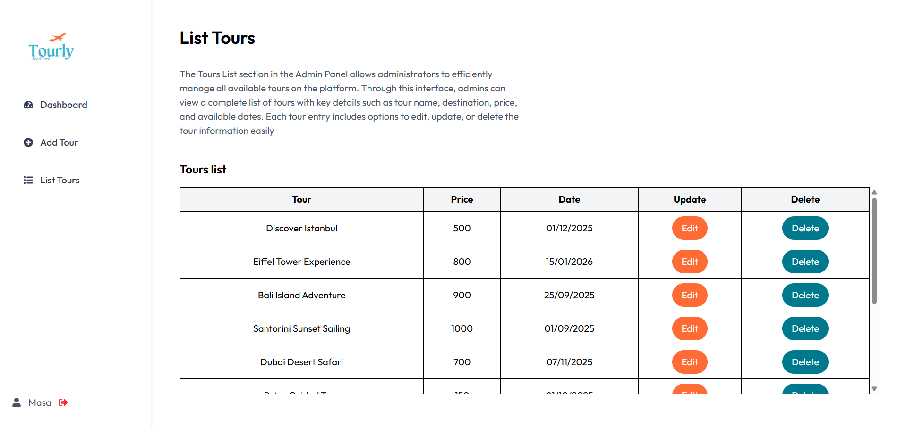

# 🌍 Tourly

Tourly is a **travel web application** built using the **MERN stack** (MongoDB, Express.js, React.js, Node.js).  
It allows users to explore destinations, book trips, and discover new places.

---

### 🚀 Features
- Browse travel destinations with images and details  
- Add and manage trips  
- Responsive design (mobile-friendly)  
- MongoDB for data storage

---

### 🛠️ Tech Stack
- **Frontend:** React.js, Tailwind
- **Backend:** Node.js, Express.js
- **Database:** MongoDB
- **Tools:** Git, Postman, VS Code

---
#### 📸 Screenshots

